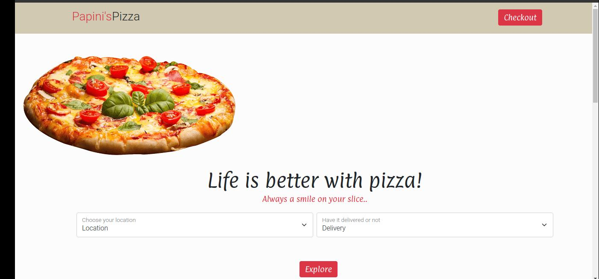

# Papini-s-Pizza-App

# Author

[Victoria Beryl](https://github.com/Victoria045)

## Description

This is a pizza web application with an option of placing as many orders as you want and have an option as a user to select if you would want it delivered to your location or not.

## Screenshot

## Setup/Installation Requirements

- Install you preferred browser
- Load the website url on your browser

## Technologies Used
- Bootstrap 5 v1.0 - 2021-07-09
- HTML
- CSS
- JavaScript
- jQuery

## BDD
**On clicking order button user is able to;**
- Choose the pizza size they want eg **Large, Medium, Small**
- Choose the kind of crust they want which are either **Crispy, Stuffed, Gluten-free**
- Choose the favorite toppings among a list of options
- Place an order and see the total charge.
- Have an option to order as many pizzas as a user may want
- Have an option of the pizza being delivered to you or not
- If delivered you have an alert of the location placed and the total charge.
- **Add to cart**

- See a checkout button that displays the total amount charged for the orders on delivery.

## Support and contact details

Incase of any issues at hand, here is the contact email address v@gmail.com

### License

MIT License.